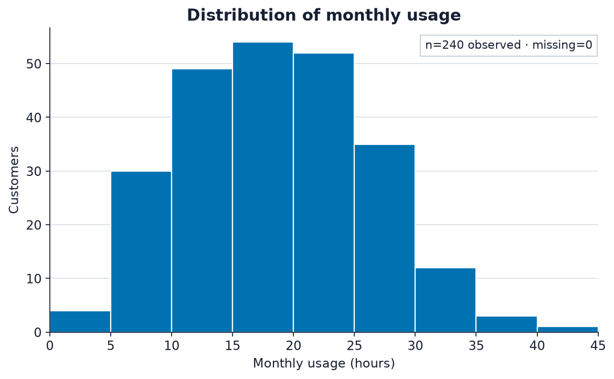
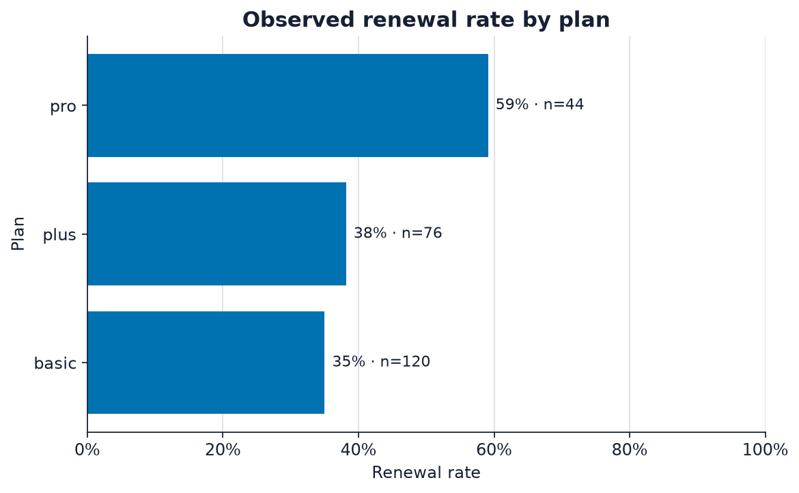

# 07 — Visualization: make one honest claim

A useful chart answers a named question and makes its evidence inspectable. Decoration comes later.

By the end of this lesson, you will be able to choose plots for distributions, relationships, and groups; use honest scales and accessible encodings; and save reproducible figures.

## Frame

Exploratory data analysis usually asks three kinds of questions:

1. **Distribution:** What values are common, unusual, or missing?
2. **Relationship:** How do two measurements vary together?
3. **Group comparison:** How does a measure differ across categories?

Begin with a sentence, not a chart type:

> How does renewal rate vary by plan, and how many customers support each rate?

A plot is a claim because position, length, colour, and scale direct attention. The code, summary table, and missing-data count are part of that claim.

## Predict

Predict which view better shows individual values:

~~~python
customers.groupby("plan")["monthly_usage_hours"].mean()
customers.plot.scatter(x="tenure_months", y="monthly_usage_hours")
~~~

The grouped mean compresses every plan to one number. The scatter plot preserves rows but may hide overlapping points. Neither is automatically better; each answers a different question.

Before drawing a renewal-rate bar chart, predict its valid y-axis range. A proportion must be between zero and one, and bars should start at zero because their lengths encode magnitude.

## Build

Load the table and create one numeric outcome:

~~~python
from pathlib import Path
import matplotlib
matplotlib.use("Agg")
import matplotlib.pyplot as plt
import numpy as np
import pandas as pd
customers = pd.read_csv("data/customer_renewals.csv").sort_values(
    "customer_id", kind="stable"
)
customers["renewed_num"] = pd.to_numeric(customers["renewed"], errors="coerce")
assert customers["renewed_num"].notna().all()
assert customers["renewed_num"].isin([0, 1]).all()
~~~

Set stable visual defaults and one save function:

~~~python
BLUE = "#0072B2"
VERMILLION = "#D55E00"
INK = "#172033"
GRID = "#CCD3DD"
plt.rcParams.update({
    "font.family": "DejaVu Sans",
    "font.size": 11,
    "axes.titlesize": 14,
    "axes.titleweight": "bold",
    "axes.labelcolor": INK,
    "axes.edgecolor": INK,
    "xtick.color": INK,
    "ytick.color": INK,
    "text.color": INK,
    "figure.facecolor": "white",
    "axes.facecolor": "white",
    "axes.spines.top": False,
    "axes.spines.right": False,
})
FIGURE_DIR = Path("docs/assets/figures")
def save_figure(fig, filename):
    FIGURE_DIR.mkdir(parents=True, exist_ok=True)
    fig.savefig(FIGURE_DIR / filename, dpi=160, facecolor="white",
                bbox_inches="tight",
                metadata={"Creator": "Data Science Python 101", "Date": None})
    plt.close(fig)
~~~

Fixed inputs, dimensions, bins, ordering, and library versions make figures repeatable. Use a random seed whenever sampling or jitter is involved.

### Distribution

Inspect counts before plotting:

~~~python
usage_all = customers["monthly_usage_hours"]
missing_usage = int(usage_all.isna().sum())
usage = usage_all.dropna()
assert not usage.empty
upper = max(5.0, float(np.ceil(usage.max() / 5) * 5))
bins = np.arange(0, upper + 5, 5)
fig, ax = plt.subplots(figsize=(7.2, 4.4), layout="constrained")
ax.hist(usage, bins=bins, color=BLUE, edgecolor="white", linewidth=1)
ax.set(title="Distribution of monthly usage", xlabel="Monthly usage (hours)",
       ylabel="Customers", xlim=(0, upper))
ax.grid(axis="y", color=GRID, linewidth=0.8, alpha=0.7)
ax.set_axisbelow(True)
ax.text(0.99, 0.96, f"n={len(usage)} observed · missing={missing_usage}",
        transform=ax.transAxes, ha="right", va="top", fontsize=10, color=INK,
        bbox={"facecolor": "white", "edgecolor": GRID, "pad": 4})
print({"observed_rows": len(usage), "missing_rows": missing_usage})
save_figure(fig, "monthly-usage-distribution.png")
~~~

```text title="Output from the course data"
{'observed_rows': 240, 'missing_rows': 0}
```



*The distribution view uses explicit five-hour bins from zero to 45 hours.
All 240 customer rows are shown and none are excluded for missing usage.*

Explicit bins make comparisons stable. Starting at zero is sensible because
negative usage is impossible. The count and missingness note keeps the plotted
subset visible.

### Relationship

Encode renewal with both colour and marker style:

~~~python
relationship = customers.dropna(
    subset=["tenure_months", "monthly_usage_hours", "renewed_num"]
).sort_values("customer_id", kind="stable")
fig, ax = plt.subplots(figsize=(7.2, 4.4), layout="constrained")
styles = [
    (0, "Did not renew", "o", VERMILLION),
    (1, "Renewed", "^", BLUE),
]
for value, label, marker, colour in styles:
    group = relationship.loc[relationship["renewed_num"].eq(value)]
    ax.scatter(group["tenure_months"], group["monthly_usage_hours"],
               label=f"{label} (n={len(group)})", marker=marker,
               color=colour, alpha=0.72, s=38, linewidths=0)
ax.set(title="Tenure and monthly usage at customer grain",
       xlabel="Tenure (months)", ylabel="Monthly usage (hours)",
       xlim=(0, 50), ylim=(0, 45))
ax.grid(color=GRID, linewidth=0.7, alpha=0.55)
ax.set_axisbelow(True)
ax.legend(title="Observed outcome", frameon=True,
          facecolor="white", edgecolor=GRID)
save_figure(fig, "usage-by-tenure.png")
~~~


*Each mark is one customer record. All 240 rows are plotted. Outcome uses both
the colour-safe blue/orange palette and triangle/circle shape, so colour is not
the only distinction.*

Transparency reveals dense regions and redundant marker shapes help when colour
is unavailable. The pattern is an observed relationship, not evidence that
increasing tenure or usage would cause renewal.

### Groups

Build the supporting table before the bars:

~~~python
plan_summary = customers.groupby(
    "plan", as_index=False, dropna=False, observed=True
).agg(
    renewal_rate=("renewed_num", "mean"),
    customers=("customer_id", "nunique"),
).sort_values(["renewal_rate", "plan"], kind="stable")
print(plan_summary.to_string(index=False))
fig, ax = plt.subplots(figsize=(7.2, 4.4), layout="constrained")
bars = ax.barh(plan_summary["plan"].astype("string"),
               plan_summary["renewal_rate"], color=BLUE)
ax.set(title="Observed renewal rate by plan", xlabel="Renewal rate",
       ylabel="Plan", xlim=(0, 1))
tick_values = np.linspace(0, 1, 6)
ax.set_xticks(tick_values, labels=[f"{value:.0%}" for value in tick_values])
ax.grid(axis="x", color=GRID, linewidth=0.8, alpha=0.7)
ax.set_axisbelow(True)
ax.bar_label(
    bars,
    labels=[
        f"{rate:.0%} · n={count}"
        for rate, count in zip(plan_summary["renewal_rate"],
                               plan_summary["customers"])
    ],
    padding=5, color=INK, fontsize=10
)
save_figure(fig, "renewal-rate-by-plan.png")
~~~

| Plan | Unique customers | Observed renewal rate |
| --- | ---: | ---: |
| basic | 120 | 35.0% |
| plus | 76 | 38.2% |
| pro | 44 | 59.1% |



*The pro group has the highest observed renewal rate and the smallest group
size. This is an association in synthetic records; it does not show that
changing a customer's plan would change renewal.*

The zero baseline makes bar length honest. Unique-customer counts prevent a
smaller group with an extreme rate from looking as certain as a larger group.

## Check

Audit the rows behind every plot:

~~~python
plot_checks = pd.DataFrame({
    "column": customers.columns,
    "missing": customers.isna().sum().to_numpy(),
})
print(plot_checks)

assert plan_summary["renewal_rate"].between(0, 1).all()
assert plan_summary["customers"].gt(0).all()
assert len(relationship) <= len(customers)
assert bins[0] == 0
assert np.all(np.diff(bins) > 0)
~~~

Also inspect the saved image at its intended display size. Labels can overlap even when code succeeds, and colour contrast can fail even when values are correct.

## Explain

Use this plot-as-claim sequence: state the question and unit; compute a supporting table; match the encoding to a distribution, relationship, or group; label units, sizes, exclusions, and scales; describe the pattern without causal language; and name a limitation.

For example: “Renewal rate is higher in plan A than plan B in this file. Plan membership may differ with tenure or signup channel, so this comparison does not show that changing plans would cause renewal.”

## Practice

1. Plot the distribution of `support_tickets` with integer-aligned bins.
2. Compare satisfaction across plans with a box plot plus visible observations.
3. Plot renewal rate by signup channel and annotate group sizes.
4. Make one misleading version by truncating a bar axis, then repair it.
5. Write alt text that states the chart type, axes, main pattern, and important exception.

For each figure, save a deterministic file and write the summary table that produced it.

## Guided practice journey

[Work through Try → Hint 1 → Hint 2 → rubric → worked reasoning](../practice/07-visualization.md).
You will repair a rate comparison before designing a distribution comparison
with visible observations.

## Keep going

Before moving on, explain why the question comes before the chart type, different questions need different encodings, bars need an honest baseline, colour should not carry meaning alone, exclusions and group sizes belong beside plots, and association is not causation.

The next lesson adds uncertainty, effect sizes, and appropriately limited statistical evidence.
